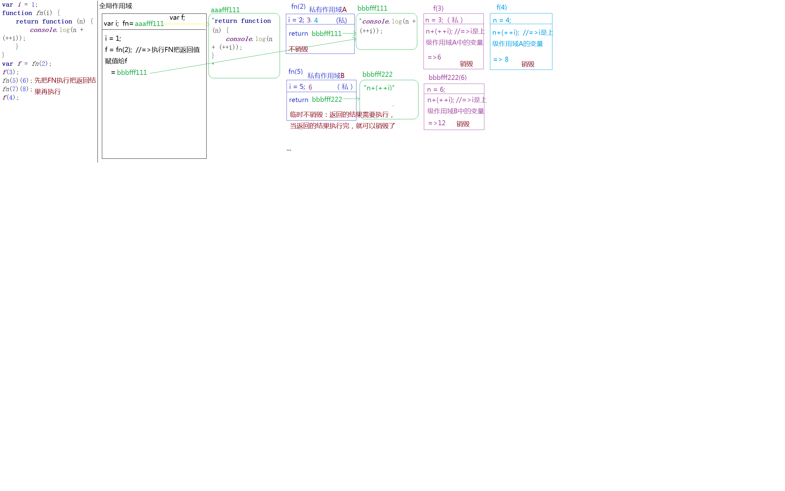
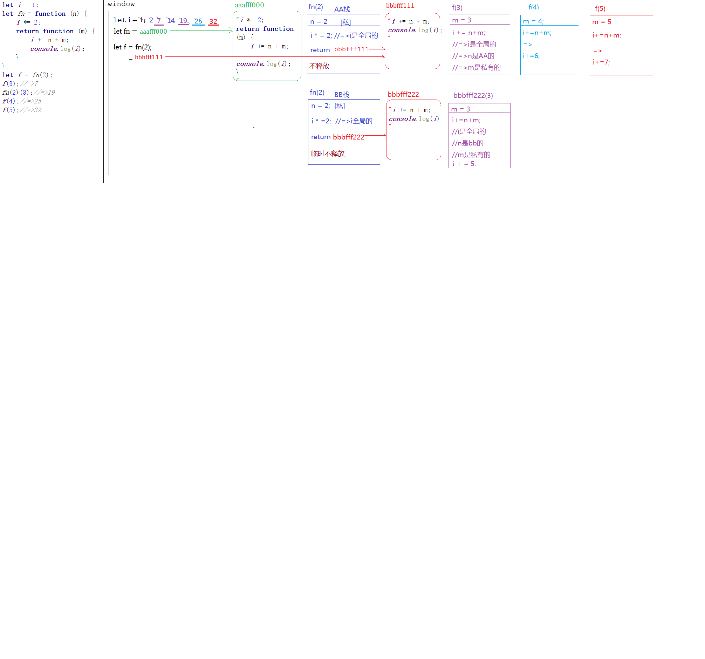

# 一、变量

## 1.1、变量提升

    =>当栈内存(作用域)形成，JS代码自上而下执行之前，浏览器首先会把所有带 “VAR”/“FUNCTION” 关键词的进行提前 “声明” 或者 “定义” ，这种预先处理机制称之为 “变量提升”

    =>声明(declare)：var a  （默认值undefined）
    
    =>定义(defined)：a=12 （定义其实就是赋值操作）

    [变量提升阶段]
    
    =>带“VAR”的只声明未定义
    
    =>带“FUNCTION”的声明和赋值都完成了

    =>变量提升只发生在当前作用域（例如：开始加载页面的时候只对全局作用域下的进行提升，因为此时函数中存储的都是字符串而已）
    
    =>在全局作用域下声明的函数或者变量是“全局变量”，同理，在私有作用域下声明的变量是“私有变量” [带VAR/FUNCTION的才是声明]

    =>浏览器很懒，做过的事情不会重复执行第二遍，也就是，当代码执行遇到创建函数这部分代码后，直接的跳过即可（因为在提升阶段就已经完成函数的赋值操作了）

## 1.2、变量相关问题

[**1、有无var的区别.html**](https://github.com/13029768866/JS-base-knowledge/blob/master/1%E3%80%81%E5%8F%98%E9%87%8F%E9%97%AE%E9%A2%98%E5%88%86%E6%9E%90/1%E3%80%81%E6%9C%89%E6%97%A0var%E7%9A%84%E5%8C%BA%E5%88%AB.html)

[**2、条件判断下的变量提升**](https://github.com/13029768866/JS-base-knowledge/blob/master/1%E3%80%81%E5%8F%98%E9%87%8F%E9%97%AE%E9%A2%98%E5%88%86%E6%9E%90/2%E3%80%81%E6%9D%A1%E4%BB%B6%E5%88%A4%E6%96%AD%E4%B8%8B%E7%9A%84%E5%8F%98%E9%87%8F%E6%8F%90%E5%8D%87.html)

[**3、重名问题处理.html**](https://github.com/13029768866/JS-base-knowledge/blob/master/1%E3%80%81%E5%8F%98%E9%87%8F%E9%97%AE%E9%A2%98%E5%88%86%E6%9E%90/3%E3%80%81%E9%87%8D%E5%90%8D%E9%97%AE%E9%A2%98%E5%A4%84%E7%90%86.html)

[**4、暂时性死区.html**](https://github.com/13029768866/JS-base-knowledge/blob/master/1%E3%80%81%E5%8F%98%E9%87%8F%E9%97%AE%E9%A2%98%E5%88%86%E6%9E%90/4%E3%80%81%E6%9A%82%E6%97%B6%E6%80%A7%E6%AD%BB%E5%8C%BA.html)

[**5、全局变量和私有变量.html**](https://github.com/13029768866/JS-base-knowledge/blob/master/1%E3%80%81%E5%8F%98%E9%87%8F%E9%97%AE%E9%A2%98%E5%88%86%E6%9E%90/5%E3%80%81%E5%85%A8%E5%B1%80%E5%8F%98%E9%87%8F%E5%92%8C%E7%A7%81%E6%9C%89%E5%8F%98%E9%87%8F.html)

[**6、arguments简单了解.html**](https://github.com/13029768866/JS-base-knowledge/blob/master/1%E3%80%81%E5%8F%98%E9%87%8F%E9%97%AE%E9%A2%98%E5%88%86%E6%9E%90/6%E3%80%81arguments%E7%AE%80%E5%8D%95%E4%BA%86%E8%A7%A3.html)

[**7、JS中的堆棧内存释放.html**](https://github.com/13029768866/JS-base-knowledge/blob/master/1%E3%80%81%E5%8F%98%E9%87%8F%E9%97%AE%E9%A2%98%E5%88%86%E6%9E%90/7%E3%80%81JS%E4%B8%AD%E7%9A%84%E5%A0%86%E6%A3%A7%E5%86%85%E5%AD%98%E9%87%8A%E6%94%BE.html)

[**8、堆栈内存释放问题.html**](https://github.com/13029768866/JS-base-knowledge/blob/master/1%E3%80%81%E5%8F%98%E9%87%8F%E9%97%AE%E9%A2%98%E5%88%86%E6%9E%90/8%E3%80%81%E5%A0%86%E6%A0%88%E5%86%85%E5%AD%98%E9%87%8A%E6%94%BE%E9%97%AE%E9%A2%98.html)

# 二、面向对象OOP

