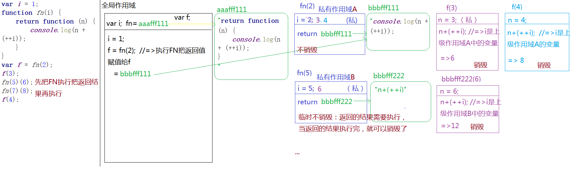
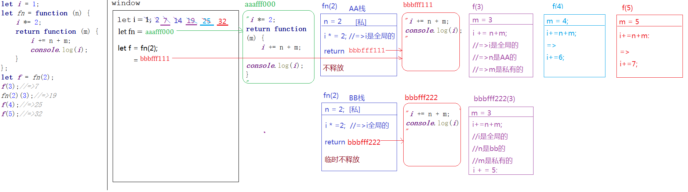
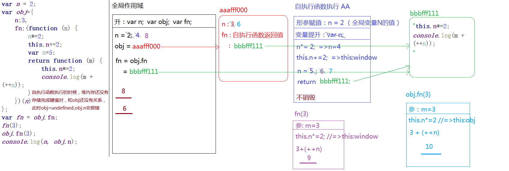
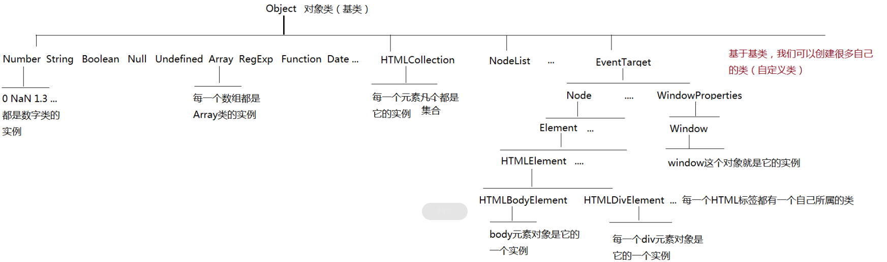
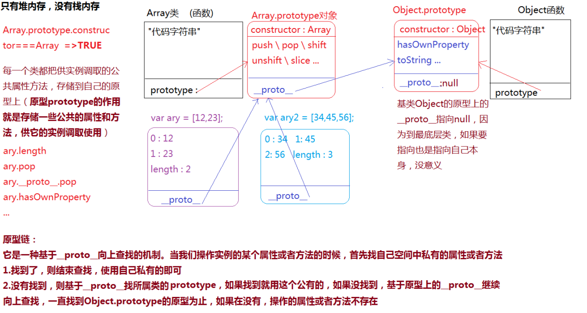
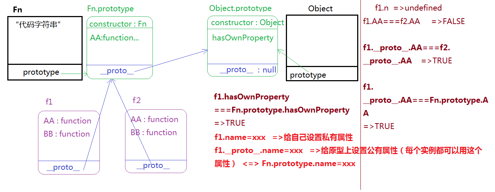
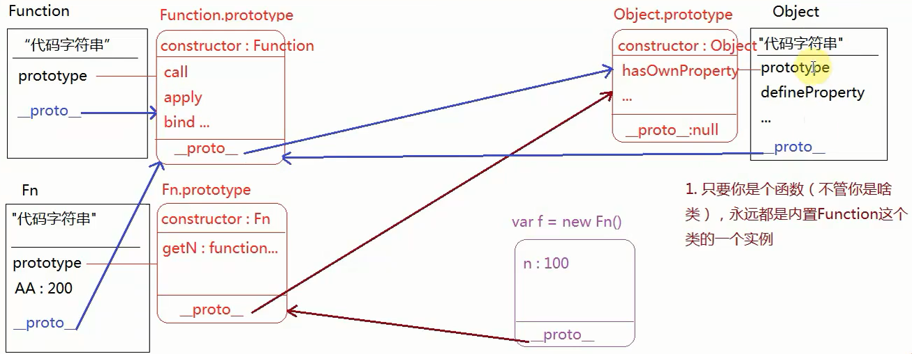

# 一、变量

## 1.1、变量提升

    =>当栈内存(作用域)形成，JS代码自上而下执行之前，浏览器首先会把所有带 “VAR”/“FUNCTION” 关键词的进行提前 “声明” 或者 “定义” ，这种预先处理机制称之为 “变量提升”


    =>声明(declare)：var a  （默认值undefined）
    
    =>定义(defined)：a=12 （定义其实就是赋值操作）


    [变量提升阶段]
    
    =>带“VAR”的只声明未定义
    
    =>带“FUNCTION”的声明和赋值都完成了


    =>变量提升只发生在当前作用域（例如：开始加载页面的时候只对全局作用域下的进行提升，因为此时函数中存储的都是字符串而已）
    
    =>在全局作用域下声明的函数或者变量是“全局变量”，同理，在私有作用域下声明的变量是“私有变量” [带VAR/FUNCTION的才是声明]


    =>浏览器很懒，做过的事情不会重复执行第二遍，也就是，当代码执行遇到创建函数这部分代码后，直接的跳过即可（因为在提升阶段就已经完成函数的赋值操作了）

## 1.2、变量相关问题

[**1、有无var的区别.html**](https://github.com/13029768866/JS-base-knowledge/blob/master/1%E3%80%81%E5%8F%98%E9%87%8F%E9%97%AE%E9%A2%98%E5%88%86%E6%9E%90/1%E3%80%81%E6%9C%89%E6%97%A0var%E7%9A%84%E5%8C%BA%E5%88%AB.html)

[**2、条件判断下的变量提升**](https://github.com/13029768866/JS-base-knowledge/blob/master/1%E3%80%81%E5%8F%98%E9%87%8F%E9%97%AE%E9%A2%98%E5%88%86%E6%9E%90/2%E3%80%81%E6%9D%A1%E4%BB%B6%E5%88%A4%E6%96%AD%E4%B8%8B%E7%9A%84%E5%8F%98%E9%87%8F%E6%8F%90%E5%8D%87.html)

[**3、重名问题处理.html**](https://github.com/13029768866/JS-base-knowledge/blob/master/1%E3%80%81%E5%8F%98%E9%87%8F%E9%97%AE%E9%A2%98%E5%88%86%E6%9E%90/3%E3%80%81%E9%87%8D%E5%90%8D%E9%97%AE%E9%A2%98%E5%A4%84%E7%90%86.html)

[**4、暂时性死区.html**](https://github.com/13029768866/JS-base-knowledge/blob/master/1%E3%80%81%E5%8F%98%E9%87%8F%E9%97%AE%E9%A2%98%E5%88%86%E6%9E%90/4%E3%80%81%E6%9A%82%E6%97%B6%E6%80%A7%E6%AD%BB%E5%8C%BA.html)

[**5、全局变量和私有变量.html**](https://github.com/13029768866/JS-base-knowledge/blob/master/1%E3%80%81%E5%8F%98%E9%87%8F%E9%97%AE%E9%A2%98%E5%88%86%E6%9E%90/5%E3%80%81%E5%85%A8%E5%B1%80%E5%8F%98%E9%87%8F%E5%92%8C%E7%A7%81%E6%9C%89%E5%8F%98%E9%87%8F.html)

[**6、arguments简单了解.html**](https://github.com/13029768866/JS-base-knowledge/blob/master/1%E3%80%81%E5%8F%98%E9%87%8F%E9%97%AE%E9%A2%98%E5%88%86%E6%9E%90/6%E3%80%81arguments%E7%AE%80%E5%8D%95%E4%BA%86%E8%A7%A3.html)

[**7、JS中的堆棧内存释放.html**](https://github.com/13029768866/JS-base-knowledge/blob/master/1%E3%80%81%E5%8F%98%E9%87%8F%E9%97%AE%E9%A2%98%E5%88%86%E6%9E%90/7%E3%80%81JS%E4%B8%AD%E7%9A%84%E5%A0%86%E6%A3%A7%E5%86%85%E5%AD%98%E9%87%8A%E6%94%BE.html)

[**8、堆栈内存释放问题.html**](https://github.com/13029768866/JS-base-knowledge/blob/master/1%E3%80%81%E5%8F%98%E9%87%8F%E9%97%AE%E9%A2%98%E5%88%86%E6%9E%90/8%E3%80%81%E5%A0%86%E6%A0%88%E5%86%85%E5%AD%98%E9%87%8A%E6%94%BE%E9%97%AE%E9%A2%98.html)



# 二、面向对象OOP

## 2.1、单例模式（Singleton pattern）

```
高级单例模式形式：
组成：命名空间 ， 闭包 ， 返回值是一个对象存放需要暴露方法
var nameSpace = (function () {
    function fn(){

    }
    return {
        fn: fn
    }
})()
```

### 2.1.1、单例设计模式优点

1. 防止冲突。
2. 使用方便。（工作使用单例模式封装utils）

```
//	=>	魏振江
var wzjRender = (function () {
    var fn = function () {
        
    };
    return {
        init: function () {

        },
        fn:fn
    }
})();
skipRender.init();


//	=>	魏振江1
var wzj1Render = (function () {
    var fn = function () {

    };
    return {
        init: function () {
            fn();//=>调取自己模块中的方法直接调取使用即可
            wzjRender.fn();//=>调取别人模块中的方法
        }
    }
})();
weatherRender.init();
```

### 2.1.2、单例模式习题

[**1、单例模式小练习.html**](https://github.com/13029768866/JS-base-knowledge/blob/master/2%E3%80%81%E9%9D%A2%E5%90%91%E5%AF%B9%E8%B1%A1/1.1%E3%80%81singleton-pattern%E5%B0%8F%E7%BB%83%E4%B9%A0.html)



## 2.2、对象，类，实例的区别

```
面向对象编程，需要我们掌握：“对象、类、实例” 的概念
    对象：万物皆对象
    类：对象的具体细分（按照功能特点进行分类：大类、小类）=>JS中的基本数据类型
    实例：类中具体的一个事物（拿出类别中的具体一个实例进行研究，那么当前类别下的其它实例也具备这些特点和特征）
```

### 2.2.1、JS中类的详细分析



## 2.3、构造函数

```
  基于构造函数创建自定义类（constructor）
    1.在普通函数执行的基础上“new xxx()”，这样就不是普通函数执行了，而是构造函数执行，当前的函数名称之为“类名”，接收的返回结果是当前类的一个实例
 
    2.自己创建的类名，最好第一个单词首字母大写
 
   3.这种构造函数设计模式执行，主要用于组件、类库、插件、框架等的封装，平时编写业务逻辑一般不这样处理
```

### 2.3.1、JS中创建值类型的两种方式

1、字面量方式

```
var obj = {};
```

2、构造函数模式

```
var obj = new Object();
=> 注意构造函数创建的是引用数据类型。
```

### 2.3.2、普通函数和构造函数执行区别

1、普通函数执行

```
1.形成一个私有的作用域
2.形参赋值
3.变量提升
4.代码执行
5.栈内存释放问题
```

2、构造函数执行

```
var f1 = new Fn('xxx', 20);
var f2 = new Fn('aaa', 30);


console.log(f1 === f2);		//=>false：两个不同的实例（两个不同的堆内存地址）
console.log(f1.age);		//=>30
console.log(f2.name);		//=>'aaa'
console.log("name" in f1);	//=>true name&age在两个不同的实例都有存储，但是都是每个实例自己私有的属性
console.log(f1.n);			//=>undefined 只有this.xxx=xxx的才和实例有关系,n是私有作用域中的一个私有变量而已（this是当前类的实例

=>	总结
1、形参私有作用域
2、变量声明提升，形参赋值
3、代码执行
4、代码执行完成前创建堆内存返回地址，并使this指向此地址
5、构造函数中this.xxx是给实例绑定私有属性，没有this的本质是函数中的一个私有变量。
```

## 2.4、原型和原型链

   1、所有的函数数据类型都天生自带一个属性：prototype（原型），这个属性的值是一个对象，浏览器会默认给它开辟一个堆内存

   2、在浏览器给prototype开辟的堆内存中有一个天生自带的属性：constructor，这个属性存储的值是当前函数本身

   3、每一个对象都有一个__proto__的属性，这个属性指向当前实例所属类的prototype（如果不能确定它是谁的实例，都是Object的实例



### 2.4.1、原型链问题

[**1、prototype原型链问题**](https://github.com/13029768866/JS-base-knowledge/blob/master/2%E3%80%81%E9%9D%A2%E5%90%91%E5%AF%B9%E8%B1%A1/2%E3%80%81prototype.html)



## 2.5、函数的三种身份

1. 普通函数
2. 类
3. 普通对象



### 2.5.1、call,apply,bind

1、call执行

```
fn.call:函数通过原型链找到Function.prototype上的call方法

细节：
1、非严格模式，不传参数，或者参数为null/undefined，this指向window
2、严格模式，不传参数this是undefined
```

[**1、call方法测试题.html**](https://github.com/13029768866/JS-base-knowledge/blob/master/2%E3%80%81%E9%9D%A2%E5%90%91%E5%AF%B9%E8%B1%A1/3%E3%80%81call%E6%96%B9%E6%B3%95%E6%B5%8B%E8%AF%95%E9%A2%98.html)

2、apply和call用法相同但是传参方式是一个数组

3、bind:语法和call一模一样，区别在于立即执行还是等待执行（不兼容ie6-8）

4、求数组最大值方法？

```
1、arr.sort(function(a,b){return b-a})[0]
2、Math.max.apply(null,arr) 
3、Math.max(...arr) 展开运算符
```

5、伪数组转化成真数组的方法？

```
1、arr = [].slice.call(arguments,0);
2、arr = [...arguments];
```

# 三、正则

## 3.1、正则小练习

### 1、年龄：匹配18-65之间？

```
let reg = /^((1[89])||([2-5]\d)||(6[0-5]))$/
```

### 2、编写一个规则，匹配“[object  AAA]”

```
let reg = /^\[object .+\]$/
```

### 3、编写一个正则匹配身份证账号

```
=> 分析:
1、身份证前六位需要获取是地区
2、跟着的年月日需要获取
3、倒数第二位需要获取是性别

let reg = /^((\d{6})(\d{4})(\d{2})(\d{2})\d{2}(\d)(?:\d))$/

reg.exec('230406199407030214')
```

### 4、有效数字正则？

```
=>分析
1、可以出现+/-号：可以没有
2、整数:一位或多位数字，多位数字不能以0开头
3、小数部分：可以有也可以没有，有小数点后面至少跟着一位数字

let reg = /^[+-]?(\d||[1-9]\d+)(\.\d+)?$/
```

### 5、手机号码？

```
=>	分析
1、11位数字
2、以1开头

let reg =/^[1]\d{10}$/
```

### 6、中文姓名？

```
=>	分析
1、中文汉字[\u4E00 - \u9FA5]

let reg =/^[\u4E00 - \u9FA5]{2,}$/
```

### 7、邮箱验证？

```
=>	分析
xxx@xx.xx
1、第一部分：数字，字母，下划线，-，. ……但是-和.不能作为开头和连续出现
2、第二部分：只能是“在数字和字母”
let reg = /^\w+([-.]\w+)*@[A-Za-z0-9]+（[-.][A-Za-z0-9]+）*(\.[A-Za-z0-9]+)$/
```

## 3.2、正则捕获

### 1、概念

把一个字符串和正则匹配的部分获取到。

**正则捕获有懒惰性**：只捕获到第一个匹配内容。（原因是reg.lastIndex值不改变）

**正则捕获的贪婪性**：每次捕获都获取正则匹配中最长的内容（解决办法/\d+?/问好放到量词元字符后面，取消正则捕获的贪婪性）

# 四、DOM盒子模型

## 4.1、Client

1、clientWidth	& 	clientHegiht

获取当前元素可视区域的高度（内容宽高	+	padding）

```
=>	获取当前（第一屏幕）屏幕（可视区域宽高）
document.documentElement.clientWidth ||	document.body.clientWidth

document.documentElement.clientHeight ||	document.body.clientHeight
```

2、clientTop		&	clientLeft

获取（上/左）边框的宽度。（只有上和左）

## 4.2、Offset

1、offsetWidth	& 	offsetHegiht	

在client的的基础上加上border

2、offsetParent	&	offsetTop	&	offsetLeft

offsetParent：当前盒子父级参照物

（offsetTop	/  offsetLeft）:当前盒子距离其父级参照物的偏移量,从单前盒子外边框 到	父级盒子内边框

## 4.3、Scroll

1、scrollWidth	& 	scrollHegiht 

真实内容的宽高

```
=>	获取当前屏幕（真实内容宽高）
document.documentElement.scrollWidth  ||	document.body.scrollWidth	

document.documentElement.scrollHegiht ||	document.body.scrollHegiht 
```

2、scrollTop	&	scrollLeft

滚动条卷曲的高度/宽度

min:0

max:真实页面高度  —	一屏幕高度（document.documentElement.scrollHegiht— document.documentElement.clientHegiht）

## 4.4、三大系列属性可读性

只有scrollTop、scrollLeft可读写，其余属性都是只读。

