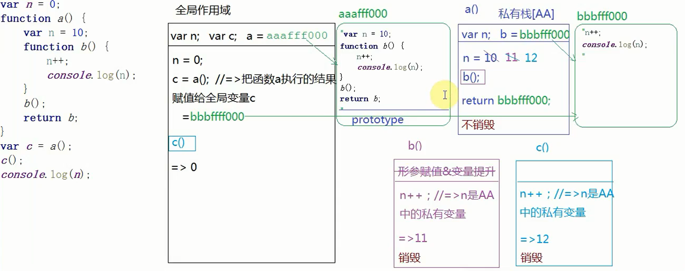
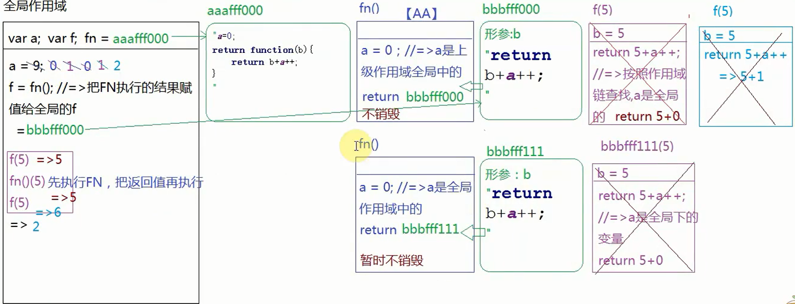
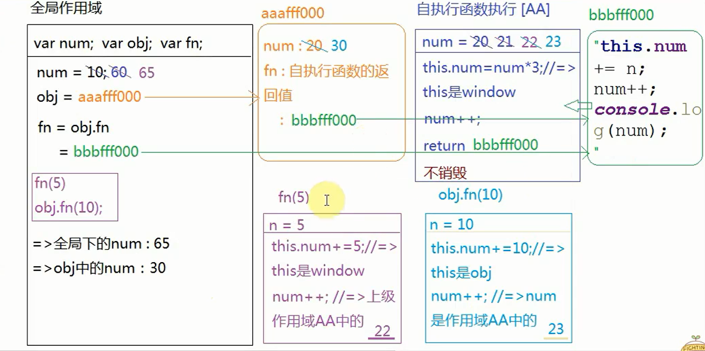
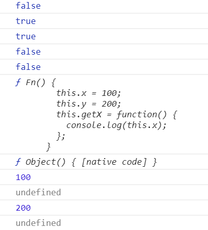
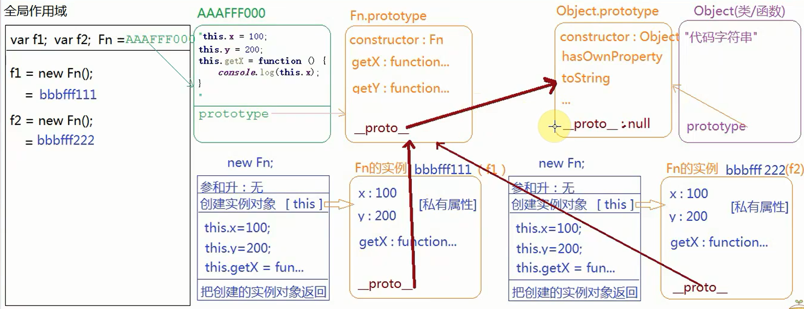
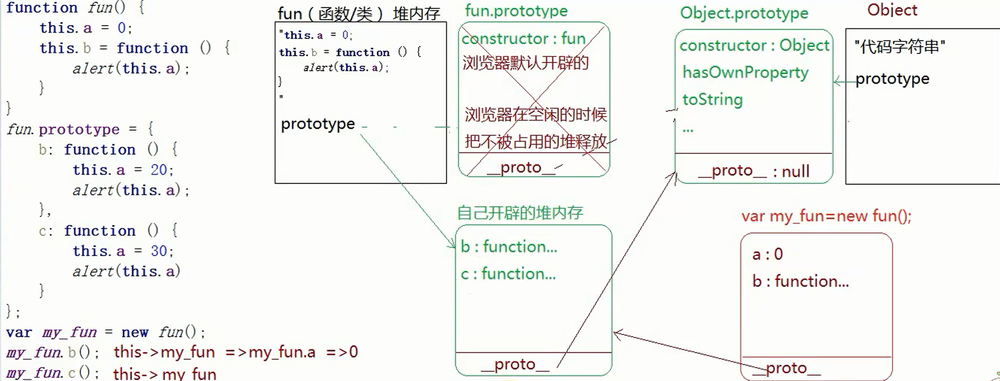
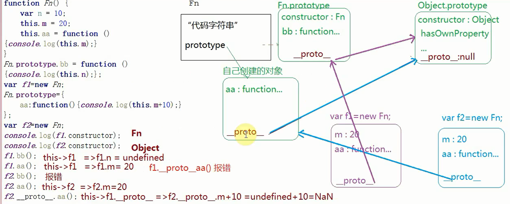
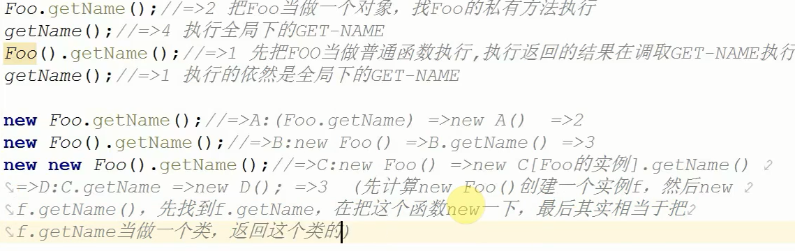

# 第一题

=>	答案：undefined，undefined，12

```
1、变量声明提升，第一个打印=>undefined
2、函数执行开辟私有作用域，变量声明提升，形参赋值，第二个打印=>undefined
3、最后打印的是全局的a,所以结果是=>12
```

# 第二题

=>	答案：undefined，12 ，13

```
1、变量声明提升第一个=>undefined
2、函数执行及没有变量声明提升也没有形参赋值，所以a根据作用域链向上查找=>12
3、a = 13 ，对全局a重新赋值，最后结果=>13
```

# 第三题

=>	答案：报错=>Uncaught ReferenceError: a is not defined

```
没有var没有变量声明提升，所以变量a并无法找到=>报错
```

# 第四题

=>	答案：10

```
1、无论条件是否成立，都会进行声明提升，所以函数执行时，局部变量foo的值是undefined
2、!foo的结果为true，所以foo的值是=> 10
```

# 第五题

=>	答案: 11 , 12 , 0



# 第六题

=>	答案：10 ，11 ，3

```
1、函数test执行，b有var，a是形参都是局部变量，c才是全局变量
2、所以结果是=>	10 , 11 , 3
```

# 第七题

=>	答案：undefined

```
1、无论条件是否成立都会变量声明提升，所以"a" in window的结果是true，取反为flase
2、条件不成立，变量a只定义不赋值结果为=> undefined
```

# 第八题

=>	答案：3, 10， undefined

```
1、函数执行形参赋值 => 3
2、argument[2] = 10,=>等同于形参赋值为 => 10
3、a = b(1,2,3),没有return，返回 =>	undefined
```

# 第九题

=>	答案：hello，hello，hello

```
1、形参赋值 =》hello
2、|| 第一个为true直接返回结果 =》hello
3、全局foo的值 =》 hello
```

# 第十题

=>	答案：5 , 5 , 6 , 2



 # 第十一题

=>	答案：[0,2,3,4]  , [100]

```
1、复杂数据类型传址，ary[0] = 0，修改同一片内存空间
2、ary = [0]把ary指针方向转向成新的内存空间
```

# 第十二题

=>	30 , 60 , 80 , 41

```
1、f(20),f(30)根据作用域链找的都是f（10）里的变量
```

# 第十三题

=>	答案：31, 32 , 43 , 44

```
1、这个里面的变量是全局变量
```

# 第十四题

=>	答案：22 ， 23 ， 65 	30



## 第十四题变种

=>	答案：52 , 41

```
1、自执行函数指向window
2、函数.前面的是this指向
```

# 第十五题

=>	答案：



=>	分析 ：

1、console.log(f1.constructor)；f1没有constructor属性，根据原型链向上找，Fn.prototype有，所以结果是Fn

2、console.log(Fn.prototype.__proto__.constructor);Fn.prototype._proto_是Object.prototype,而Object.prototype的constructor属性指向Object这个内置构造函数，所以JS万物皆为对象。



# 第十六题

=>	答案：

```
1、为什么不行？
关键字：事件绑定是异步编程、作用域链
事件绑定是异步编程,点击行为触发时，外层循环早就结束了。方法执行形成私有作用域，根据作用域链机制找到全局i，i的结果是循环结束后的结果。

2、ES6解决方法
把var替换成let，let声明会形成块级作用域，把每个索引i存储到自己作用域中。
```

# 第十七提

=>	答案：undefined , 'language'

```
1、console.log(obj.prop.getFullName());中this指向obj.prop也就等于obj.prop.fullName
2、test()函数执行this指向稳window，所以结果 =>'language'
```

# 第十八题

=>答案：window

```
fun()函数执行，this指向window
```

# 第十九题

=>答案： 0 , 30



**注意：项目中不可以改变JS内置类的原型指向，这样会失去原先的方法，并且没有constructor属性**

# 第二十题

=>答案：



```
1、自己穿件的Fn.prototypr没有constructor属性
2、this指向问题，指向函数调用者就是点前面的那个东西
```

# 第二十一题

```
模仿数组的Api形式
思路：利用对象属性是惟一的，通过hasOwnProperty检测，修改原数组，如果重复把当前项和末项对掉，继续当前循环
Array.prototype.myUnique = function myUnique(){
      var obj = {};
      for(var i=0;i<this.length; i++){
        var item = this[i];
        obj.hasOwnProperty(item)?(this[i] = this[this.length - 1],this.length--,i--):obj[item] = item;        
      }
      // 浏览器有垃圾回收机制，这里手动释放，防止内存占用！
      obj = null;
      // 返回this本身是为了链式调用
      return this;
    }
```

# 第二十二题

=>答案：null ,undefined

```
1、parentNode是查询元素的父节点，而document是最大的父节点，他的父节点为null
2、parentnode是属性，没有声明document没有这个属性，所以结果是undefined
```

# 第二十三题

=>答案：基于 单例模式，amd , cmd , commonJS实现模块化开发

```
单例模式：实现当前模块的功能和属性放在同一个命名空间下，暴露出init
```

# 第二十四题

```
闭包功能有两个：保护和保存
```

# 第二十五题



# 第二十六题

=>	答案：**利用sort方法，sort中参数a,b代表数组的当前项和下一项，return a-b,如果返回的值大于0，两项交换位置，小于等于零什么都不做。**

```
 let arr = [1,2,3,4,5,6];
 arr.sort((a,b) => {
 return Math.round(Math.random() * 10 - 5);
 })
```

