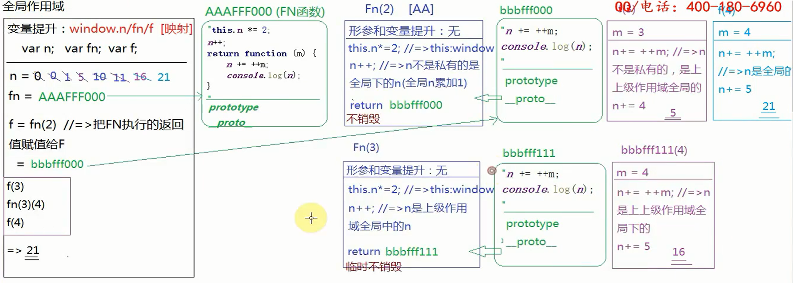

# 第一题

=> 	答案：undefined

```
=>	分析
1、不管条件是否成立，都进行变量声明提升，所以'm' in window成立
2、&& m的值为undefined，断路原则，所以结果是undefined
```

# 第二题

=>	答案：报错

```
=>	分析：
1、let没有变量声明提升，但是有词法分析
2、var声明赋值分三步，先声明，然后准备值，最后关联
3、let声明赋值分两步，准备值，关联
4、所以let n= n+30,先准备n+30,在声明n
5、所以 => 报错，n is not defined
```

# 第三题

=>	答案：（20，undefined）（10,20）

```
=>	分析
1、全局下m赋值给私有的n
2、形参赋值 n=20,m =undefined
3、在非严格模式下，形参和arg存在映射机制，但是此时arg没有第二项，所以m无法与arg建立映射
4、映射机制建立联系是在形参赋值时，如果在形参赋值时没有建立联系，以后就不会建立联系
```

# 第四题

=>	([23,34])	([12,23,34])

```
=>	分析
1、ary.pop();执行时，修改的时全局的ary的内存空间
2、ary = ary.slice(0);开辟了一个新的空间
```

# 第五题

=>	答案：5，16 , 21 , 21



## 第五题变种

=>	答案：0，-8，-14，-14

