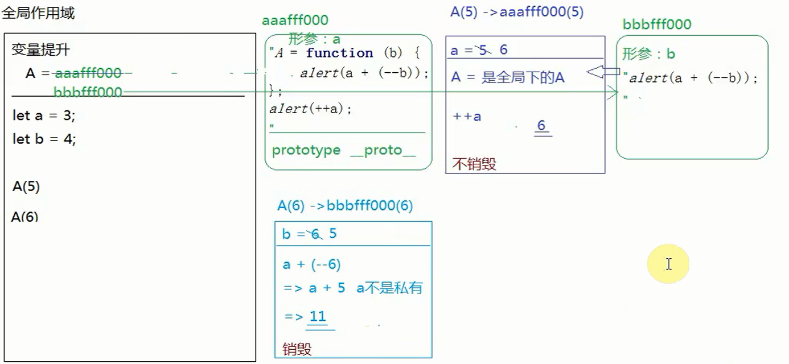

# 第一题

```

-1、let/const
1)let不存在变量声明提升
2）let不允许重复声明
3）全局作用域中let声明的变量和window没有映射关系
4）typeof未被声明的变量 =>结果是报错不是undefined（暂时性死区）
5)形成块级作用域
-2、解构赋值
-3、“...”拓展运算符
-4、箭头函数
1）没有arguments，...arg获取实参集合
2）没有自己的this，this是上下文中的this
-5、模板字符串
-6、Promise（async/await）
-7、class
-8、interator（for of 循环）
-9、Map /	Set

```

# 第二题

1、浏览器渲染页面4步

2、重绘：不改变位置和大小的情况下，改变样式 ----重新加载RENDER TREE

3、重排：改变大小和位置	----	重新加载DOM TREE

4、缺点：不论是重排还是重绘都非常耗费性能

5、解决方案：减少DOM操作

​	1)把需要增加的元素拼接成字符串，最后统一进行增加

​	2）读写分离：把统一样式放到一起执行，新版浏览器有一个检测机制，会把修改样式的操作存起来，直到遇到非修改样式的操作，会把之前存储的统一执行，引发一次回流和重绘

```
浏览器渲染页面时，
“先创建DOM树->再加载CSS->生成渲染树RENDER TREE->把渲染树交给浏览器进行绘制”，
如果后期修改元素的样式（没有改变大小和位置），浏览器会把当前元素重新渲染生成渲染树，重新渲染，这个机制是---重绘，
如果元素的位置和大小发生改变，浏览器就要从DOM树重新计算渲染

```

# 第三题

=>	答案：number

```
1、NaN ！= NaN
2、parseFloat遇见非数字返回NaN
3、 typeof NaN == ’number‘
```

# 第四题

=>	abc123456,

​	333,

​	字符串“1”

```
1、+字符串拼接
2、“-”数学运算
3、alert输出字符串“1”
```

# 第五题

=>	答案：

let reg= /^[0-9a-zA-Z]{2|20}$/

# 第六题

JS本身就是基于面向对象（OOP）编程思想开发出来的语言，

数组是Array的实例，对象是Object实例，函数Function实例，这些内置类的原型上有很多公共属性和方法可以被实例调用

基于class或者function创建一个类，执行的时候new创建一个实例，类的继承，封装，多态。

**封装**：提取公共方法,主要目的：’低耦合，高内聚‘

**多态**：JS中没有严格意义的多态，不能进行方法的重写

1）重载：方法名相同，参数个数或者类型不同，此时名字相同的方法叫做方法的重载，**JS中不存在重载，后端重载的意义是为了抗压**

2）重写：子类重写父类的方法

**继承**：

1、原型继承：**让子类的原型指向父类的实例**

缺点：**1、子类可以重写父类原型上的方法（重写），子类和父类还有关系**

​		**例如 B.prototype.__proto__.getX = null,A的其他实例会受影响**

​	**2、父类的私有属性和工友属性都变为子类的公有属性**

​	**3、子类原型上之前有的属性方法，都无法使用**

2、call继承：**把父类A作为普通函数执行，让A中的THIS变为B的实例，相当于给B的实例增加属性和方法**

​	缺点：**只把A中的私有属性变为B实例的私有属性，A原型上的属性和方法跟B没有关系

3、组合继承：**重写太方便，可以轻易修改A的父类**

4、寄生组合继承

5、es6中的继承，项目中都是基于class和extend实现继承

​	constuctor:存放私有属性

​	只能存放方法，不能存放属性。

​        extends实现继承，给constructor第一行加一个super(),super类似于call改变this指向

```
//  原型继承
    function A() {
        this.x = 100;
    }
    A.prototype = {
        constructor:A,
        getX: function () {
            console.log(this.x);
        }
    }

    function B() {
    	//	call继承
    	A.call(this)
        this.y = 200;
    }
    // 原型继承
    B.prototype = new A();
    let f =new B();
    
    
    
//	组合继承
function A() {
       this.x = 100;
   }
   A.prototype = {
       constructor: A,
       getX: function () {
           console.log(this.x);
       }
   }
   function B() {
       A.call(this);
       this.y = 200;
   }
   B.prototype = A.prototype;
   let b =new B();
   
   
   
 //	寄生组合继承
 Object.create():创建一个新对象，让其__proto__指向传递进来的第一个对象
 
 function A() {
       this.x = 100;
   }
   A.prototype = {
       constructor: A,
       getX: function () {
           console.log(this.x);
       }
   }
   function B() {
       A.call(this);
       this.y = 200;
   }
   B.prototype = Object.create(A.prototype);
   let b =new B();
   
 
 // ES6继承
 class Fn{
    constructor(n,m){
        this.x  = n,
        this.y = m
    }
    getX(){
        console.log(this.x);
    }
    
    // 给Fn设置私有属性
    static AA(){
        
    }
}
```


# 第七题

=> 10 , 

​      20

```
函数执行this指向window
```

# 第八题

=>  答案：10，

​		  30

```
方法执行看“.”前面的是谁
```

# 第九题

=> 答案：8，11 ,  2

# 第十题

当前作用域没有的变量，会根据作用域链向上查找，只到找到全局的window为止。

原型链：画图分析，讲解。

# 第十一题

需求：在1-100之间获取及时3的倍数也是5的倍数的和？

```
// 递归算法
  function fn(n){
        if(n === 0){
            return 0;
        }
        if(n % 15 === 0){
            return n + fn(n - 1)
        }
        return fn(n - 1);
    }
 
//	数组扁平化
 1)骚操作，只能用于多位数组中没有对象的情况
 let ary = [1,[2,[3,[4,5]]],6];
 let str =  '[' + ary.toString() + ']';
 let ary1 =JSON.parse(str)
 2)递归操作
    let result =[];
    function fn(ary) {
        // 设置结束递归条件
        if(ary.length === 0){return};
        for(let i= 0;i<ary.length;i++){
            let item = ary[i];
            if(typeof item === 'object'){
                fn(item)
            }else{
                result.push(item)
            }
        }
    }
    
 
```

# 第十二题

=> 思路：查询目标项后面是否有其他兄弟元素，如果有parentNode.insertBefore('newEle','next'),如果没有直接添加到末尾

```
function insertAfter（newEle , originEle）{
    let next = originEle.nextElementSilbings，
    	parent = originEle.parentNode;
    if(next){
        parent.insertBefore(newEle,next)
    }else{
        parent.appendChild(newEle)
    }
}
```

# 第十三题

```
let reg = /\s*[a-zA-Z]+\s*/g;
str = str.replace(reg,(...arg)=>{		
    return ` ${arg[0]} `
})
```

# 第十四题

1、JQuery是一个JS类库，里面提供了许多便捷方法，有助于快速开发。

2、JQ就是一个类，提供方法有两部分，一部分放在原型上，一部分放在对象上直接调用

# 第十五题

=>	答案：undefined，{n:10}

# 第十六题

```
// 闭包是JS中一个非常重要的机制，我们很多编程思想、业务逻辑、设计模式都是基于闭包完成的，先说一下我对闭包的理解：闭包就是函数执行产生一个私有的作用域（不销毁），在这个作用域中的私有变量和外界互不干扰，而且作用域（栈）不销毁，这些私有变量存储的值也都保存下来了，所有整体来说闭包就是为了保护和保存变量的
// 实际项目开发中，很多地方使用到了闭包，例如：
// 1.循环事件绑定，由于事件绑定是异步编程的，我们此时在循环的时候把索引存储起来（可以基于自定义属性存储，也可以基于闭包存储），后期需要使用的时候，向上级作用域查找使用即可
// 2.平时做业务逻辑的时候，我一般都是基于单例模式来管理代码的，这种单例的构建就应用到了闭包
// let xxxRender=(function(){
//     return {
//         init:function(){
//
//         }
//     }
// })();
// 3.我之前在学习资料上了解了柯理化函数思想，它其实也是基于闭包完成的
// Function.prototype.bind = function bind(context, ...arg) {
//     return () => {
//         fn.call(context, ...arg);
//     }
// };
// document.onclick=fn.bind(obj, 10, 20);
//
// 还有很多地方也应用了闭包，但是闭包比较占内存，我会尽量减少对它的使用，但是有些需求必须要用
```

# 第十七题

=>	答案： 6 ， 11

